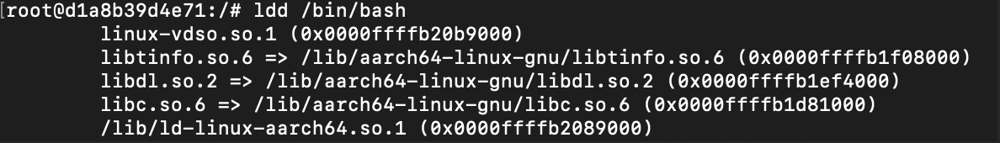

**In this blog, you'll learn about Linux, how containers work, and how to create a container by hand.**

<!-- truncate -->

**Have you ever wondered what would happen if you had multiple containers within a container, where the inner containers don't have outside access? Imagine three friends buying a virtual server—they're all on the same powerful machine but can't access or see each other's processes. Let's dive into this concept, but first...**

### Let’s start with why first, why we need containers

(You can totally skip this part if you're just here for the container magic - but trust me, knowing how we got here makes you appreciate the cool stuff even more!)

Historically, if you wanted to run an application, you needed a server. You had two options: set up your own or rent one from a company. Managing a server was complex—you had to handle hardware, software, and cables. You'd also need to pay internet bills, allocate a separate room, and even hire staff to maintain and update the server. Additionally, you'd need to implement authorization measures so only specific individuals could access the server room.

VMs were the next step in this evolution. A **Virtual Machine (VM)** is a software-based emulation of a physical computer. It allows you to run multiple operating systems (OS) on a single physical machine simultaneously. Each VM functions as an independent system, with its own virtualized CPU, memory, network interface, and storage resources. Why is this helpful? Imagine having a powerful server where you can create virtual servers at will. If you need to add a new service, you can easily spin up a new VM on one of your servers (provided you have enough space).

Imagine McDonald's and Burger King buy servers from AWS to store their data. AWS, wanting to be efficient, allocates virtual servers to them from a single large physical server. If AWS puts them on the same server without proper separation, a McDonald's engineer might hack the other company's server. Alternatively, if one company uses excessive CPU or memory, it could affect the other company since they share the same server. This is where VMs come in. The host operating system offers each VM a certain amount of resources that it can use. If one VM runs out of resources, it doesn't affect other VMs. But running an operating system inside the operating system comes at a cost of a bit of performances.

This is where containers come in. Containers provide the same security and resource-management features as VMs but without the overhead of running a whole operating system. Instead, they use technologies like chroot, namespaces, and cgroups to separate groups of processes from each other.

### What is Container?

A **container** is a lightweight, portable software unit that packages an application with all its dependencies, libraries, and configurations. This packaging allows the application to run consistently across various environments. Unlike virtual machines, containers share the host operating system's kernel while remaining isolated from each other. This shared kernel approach makes containers faster and more efficient.

### Let’s craft a container

For the understanding of how we can create a container inside a container with proper seperation I’ll be using docker.(you can use VM or linux whatever you like)

Let's try it out. First, we'll create a Docker container using this command:

```jsx
docker run -it --name main-container --privileged ubuntu:focal
```

This command will download the official Ubuntu container from Docker Hub and use the version marked with the "focal" tag.

( The `docker run` command creates and starts a new container based on a specified image (in this case, `ubuntu:focal`). The `-it` flag makes the shell interactive (like a terminal). `--name main-container` assigns the name "main-container" to the container, which we can use to delete or stop it in future commands. The `--privileged` flag grants the container extended privileges, such as access to all devices on the host.)

### Chroot

Now our objective is to create a container inside the container and modify the inner container so it cannot access the outer container's information.

Let's create a folder inside the container. First, make a new folder in your root directory with this command: `mkdir first-root-container`. Inside this new folder, create a file called `my-data.txt` using the command: `cat > my-data.txt`. You can write something in this file, then press Ctrl + C to save and exit.

Now, to set the root directory for a new process, we'll use `chroot`. This Linux command changes the root of the process. In our container use case, we'll use it to change the root to our new directory (first-root-container).

```jsx
chroot /first-root-container bash
```

If we run this command directly, it will show an error: `chroot: failed to run command 'bash': No such file or directory`. This happens because bash is a program, and your new root doesn't have bash to run (it can't reach outside its new root). Let's fix that by running:

1. `mkdir /first-root-container/bin`
2. `cp /bin/bash /bin/ls /first-root-container/bin/`

We've now moved bash and ls from the root directory to our first-root-container directory. However, the chroot command still won't work because these commands rely on libraries we haven't moved yet. To check which libraries we need, run this command in your root directory: `ldd /bin/bash` .



You'll see these libraries in your terminal. We need to move them to our new root. Let's copy them to our new environment:

First, create a new folder: `mkdir /first-root-container/lib`. Now, copy all the required libraries into our directory. Run the `ldd /bin/bash` command to check which files you need to move.

1. `cp /lib/aarch64-linux-gnu/libtinfo.so.6 /lib/aarch64-linux-gnu/libdl.so.2 /lib/aarch64-linux-gnu/libc.so.6 /first-root-container/lib`

We've moved the libraries for bash, but we also copied `ls`, so repeat this step for ls (`ldd /bin/ls`) to ensure you can run this command in our new root directory.

Finally, you can run the command `chroot /first-root-container bash` and use ls in your new root directory. This is now your new container, and you can't access anything outside it. To exit your chrooted environment at any time, press CTRL+D or run `exit`.

Let's say you have a big server (your main container) and you're giving spaces to your friends to run their code. Separating spaces is your first line of defense. You could log them into chroot'd environments and limit them to use only those. This way, they can't see each other's files. So, chroot solved the problem by limiting them to their own spaces. However, despite not being able to see the files, they can still see the processes running on the server. Anyone can kill other processes, unmount file systems, or even hijack processes.

If you open another terminal and run `docker exec -it main-container bash`, you'll get a new terminal session. In this session, if you start a background process (like `tail -f /first-root-container/secret.txt &amp;`) and then run `ps`, you'll see all processes in this second terminal session. However, if you copy a process ID (PID) from here and run `kill PID` in your chroot'd environment (the first session), it will terminate that process. This demonstrates the scenario I described earlier—processes aren't isolated between these environments.

### Namespace

So Now namespace comes into the picture, it allow you to hide processes from other processes. so if we give each of your friend different chroot’d environment and different set of namespace then they can’t see each other processes and they can’t hijack or steal something as they can’t see.

So Let’s create a new chroot’d environment now that isolated using namespaces. `unshare` creates a new isolated namespace from its parent(main-container) and all other friends(servers). Run this in your main-container:

```jsx
## Install debootstrap
apt-get update -y
apt-get install debootstrap -y
debootstrap --variant=minbase focal /new-root

# head into the new namespace'd, chroot'd environment
unshare --mount --uts --ipc --net --pid --fork --user --map-root-user chroot /new-root bash
mount -t proc none /proc # process namespace
mount -t sysfs none /sys # filesystem
mount -t tmpfs none /tmp # filesystem
```

This will create a new isolated environment with its own PIDs, mounts (like storages). Now we can't see any of the processes!

Now try the above exercise again:

1. Run `tail -f /my-new-root/secret.txt &` from #2
2. Run `ps` from #1, grab pid for `tail`
3. Run `kill <pid for tail>`, and it will not work.

We've used namespaces to protect our processes! While we could delve into other namespaces, the principle remains the same: they're used to restrict containers' abilities to interfere with each other. This isolation serves two purposes—preventing malicious activities and safeguarding us from accidental mishaps.

Now you have environments isolated from each other, and your friends can do anything in their environments without issue, as no one can see their processes. However, there's still one concern: what if one of your friends runs a script that uses all of the main container's CPU and memory? In this case, your other friends' servers could go down without warning.

This is where **cgroups** (control groups) come into play. By visiting the cgroup directory (`/sys/fs/cgroup`), you'll see files like `cpu.max` and `cgroup.procs` that let you fine-tune resource allocation for each environment. For example, creating a new cgroup:

```jsx
mkdir / sys / fs / cgroup / sandbox;
```

will give you the ability to set limits on CPU and memory for the `sandbox` group, ensuring no single environment can monopolize resources.

> But cgroups are a complex topic, so I'll save a deep dive into them for a future blog post. Stay tuned!
